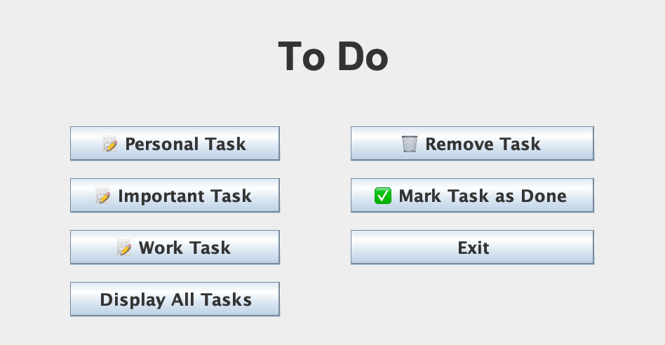
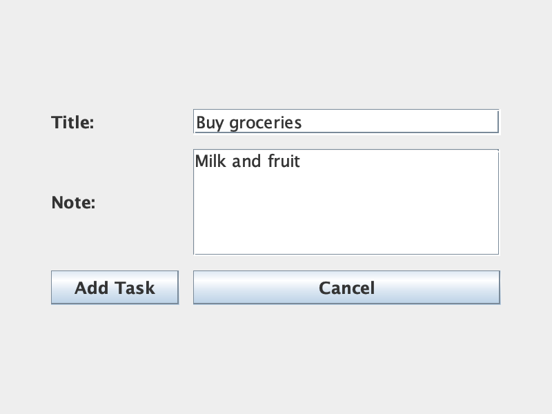
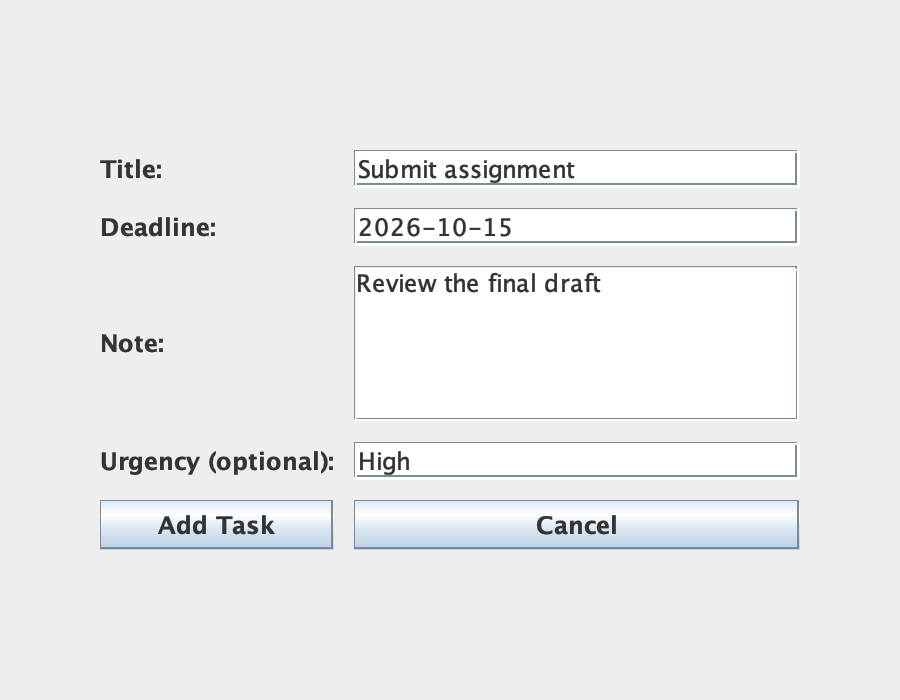
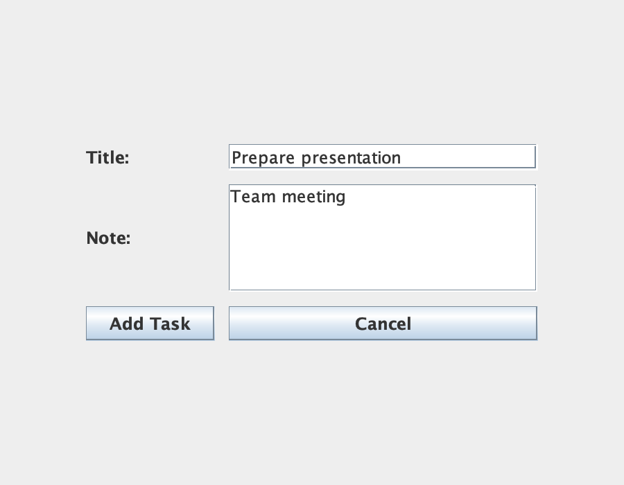

# GUI and Program Output

## GUI Preview

These images were rendered from the project's Swing component layouts, with sample form values, using the cross-platform look and feel. They show the main window and the three task forms. The desktop application could not launch in the capture environment, so these are offscreen previews, not live desktop screenshots or evidence of tested button interactions. The temporary rendering code replaces the window shell with a panel; the application source is unchanged.

### Main Window



### Personal Task



### Important Task



### Work Task



The work-task form asks for the number and names of subtasks in separate dialogs after selecting **Add Task**. Those dialogs are not pictured here.

## Program Output

The console output below was captured by running `ExampleRun` with the project's task and linked-list classes. **Display All Tasks** in the GUI also writes to the terminal or IDE output window.

## Run the Example

```bash
javac -encoding UTF-8 -d out *.java
java -cp out com.gamar.project_netbeans.ExampleRun
```

The example does not create or change saved task files.

## Console Output

```text
=== Add Tasks ===
Task added successfully!
Task added successfully!
Subtask 'Write the outline' added to work task.
Subtask 'Create the slides' added to work task.
Task added successfully!

=== All Tasks ===
[Personal Task]
Title: Buy groceries
Note: Milk and fruit
Completed: false
----------------------
=== DEADLINE TASK ===
>----- IMPORTANT TASK -----<
Title: Submit assignment
Note: Review the final draft
DeadLine Due:2026-10-15
Completed: false
>--------------------------<
Urgency Level: High
=====================
>----- WORK TASK -----<
Title: Prepare presentation
Note: Team meeting
Completed: false
Number of Subtasks: 2
Subtasks:
SubTask : Write the outline
SubTask : Create the slides
>----------------------<

=== Complete a Task ===
Task : Buy groceries , marked as done .
[Personal Task]
Title: Buy groceries
Note: Milk and fruit
Completed: true
----------------------

=== Duplicate Title ===
Task already exists!

=== Remove a Task ===
Task removed!

=== Find a Missing Task ===
Task not found!
```
